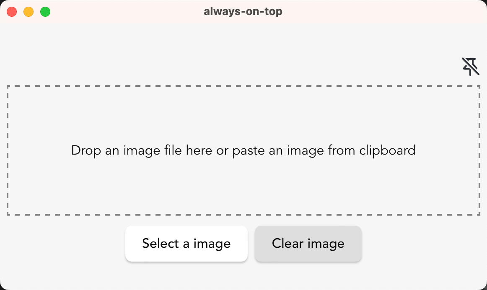

# Always on top
A tool can sticky to the top of window that support uploading image from local or pasting from clipboard.

Builded by Tauri and Svelte.

# how to use
1. clone the repo

2. install the dependecies by `yarn`

3. preview locally by `yarn tauri dev`

4. release `yarn tauri build`

If you use Mac, you can download the release build from [release](https://github.com/tiodot/always-on-top/releases/tag/v0.0.1). If you want to build for Windows, you need to change the config in `src-tauri/tauri.conf.json`, change the `bundle: targets` to your target platform.

## Recommended IDE Setup

[VS Code](https://code.visualstudio.com/) + [Svelte](https://marketplace.visualstudio.com/items?itemName=svelte.svelte-vscode) + [Tauri](https://marketplace.visualstudio.com/items?itemName=tauri-apps.tauri-vscode) + [rust-analyzer](https://marketplace.visualstudio.com/items?itemName=rust-lang.rust-analyzer).
